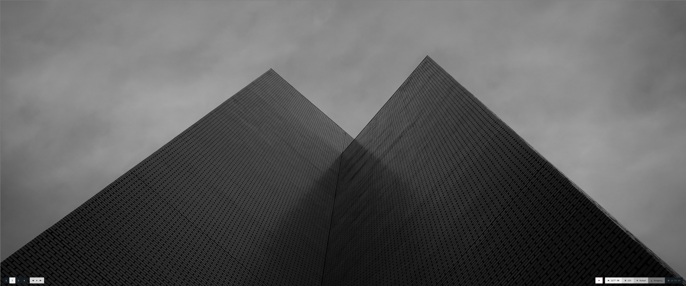

<h1 align="center">Dotfiles 👋</h1>

 

> [Custom Dotfiles](https://wiki.archlinux.org/title/Dotfiles) for configuration, customization, scripting, and ricing, within the Linux System.

## Author

👤 **RunTankRun**

* Github: [@runtankrun](https://github.com/runtankrun)

