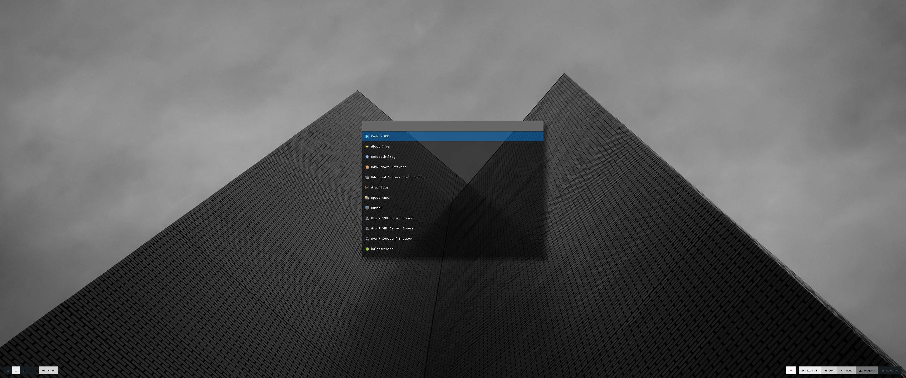

<h1 align="center">dotfiles 👋</h1>

 

> Custom Dotfiles for Linux configuration, customization, scripting, and ricing

## Author

👤 **RunTankRun**

* Github: [@runtankrun](https://github.com/runtankrun)

